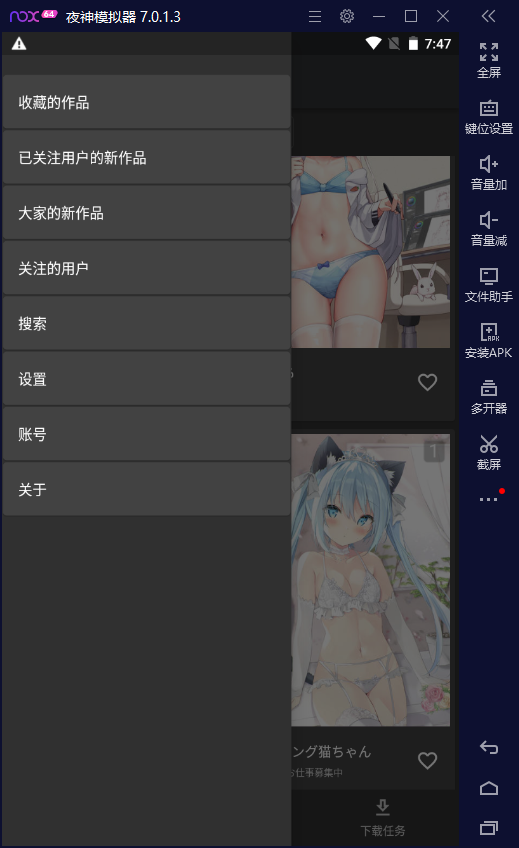
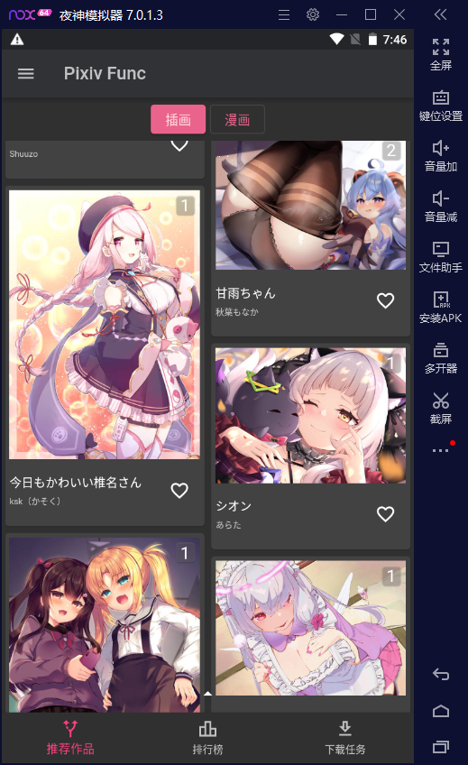
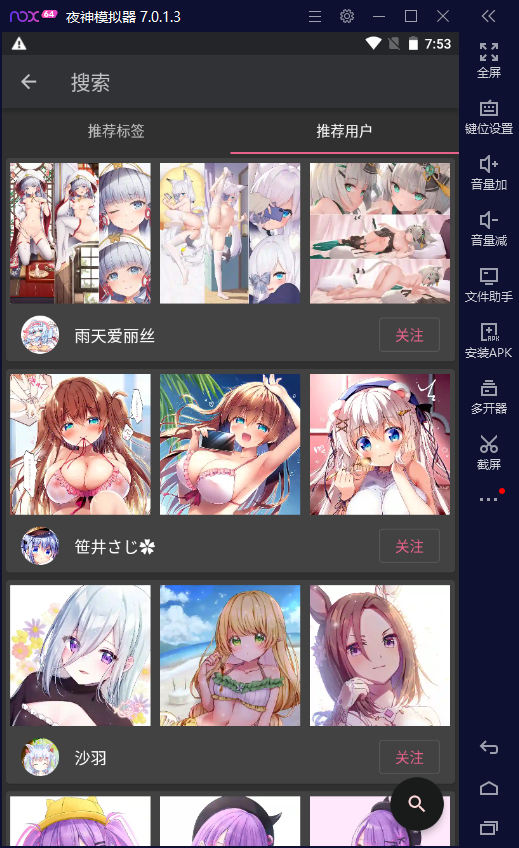
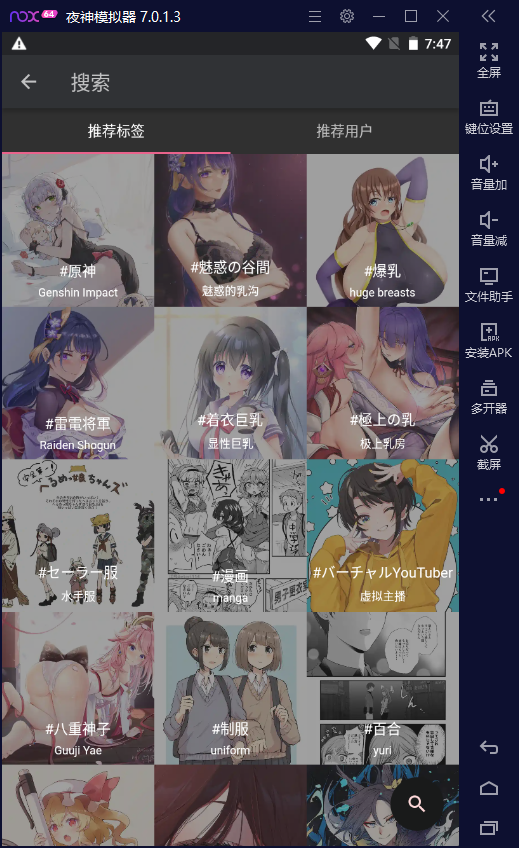
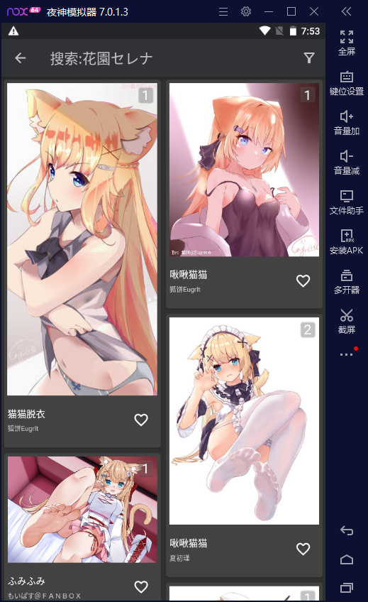
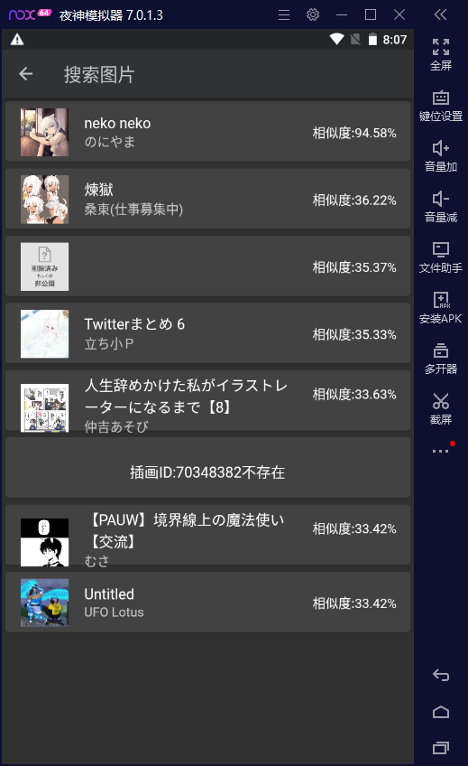
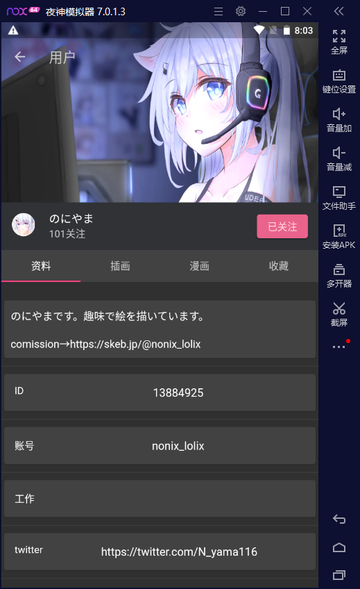
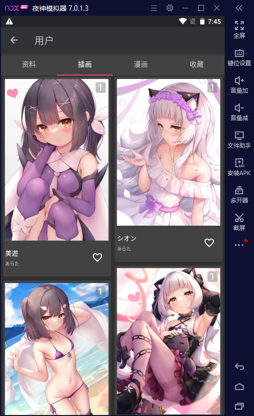
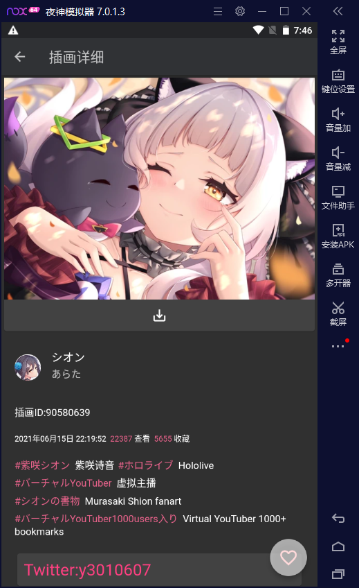

# 只是一个`Pixiv`客户端
## _该项目与一切现有同类项目无关,请不要拿来比较_

## _夹批搪与牲口不得使用_

此软件开源且免费(不收取打赏) 禁止用于盈利(包括但不仅限于收取打赏)

#### 我对`人`是非常友好的(😊), 如果发现Bug或者不合理的地方或者想要新增功能(我会酌情考虑要不要做)请打开一个 [Issue](https://github.com/xiao-cao-x/pixiv_func_android/issues/new) 哦

如果你觉得我的软件好用 可以推荐给朋友

前往 [Release](https://github.com/xiao-cao-x/pixiv_func_android/releases) 下载

## 支持功能如下

| 名称 | 备注 |
| --- | --- |
| 登录 | 用的 [WebView](https://github.com/xiao-cao-x/pixiv_func_android/blob/main/android/app/src/main/kotlin/top/xiaocao/pixiv/platform/webview/PlatformWebView.kt) 登录需要开代理(VPN) |
| 查看推荐作品 | 插画 & 漫画 |
| 查看收藏作品 |  |
| 查看已关注用户的最新作品  |  |
| 查看陌生人的最新作品 | 插画 & 漫画 |
| 查看关注用户 |  |
| 查看排行榜 |  |
| 搜索推荐 | 推荐用户 & 推荐标签 |
| 搜索插画或漫画  | 支持排序,支持时间范围,支持搜索ID,支持按收藏数量搜索 |
| 搜索用户 | 支持搜索ID |
| 查看动图 | [Native合成GIF图片](https://github.com/xiao-cao-x/pixiv_func_android/blob/main/android/app/src/main/kotlin/top/xiaocao/pixiv/platform/api/PlatformApiPlugin.kt#L107) |
| 图片搜源 | [集成了一个外部网站(非WebView)](https://github.com/xiao-cao-x/pixiv_func_android/blob/main/lib/view_model/search_input_model.dart#L124) |
| 保存原图到系统相册 | 可以查看下载任务 |
| 关注和取消关注(用户) |  |
| 收藏和取消收藏(插画 漫画) |  |

 
菜单

---

 
推荐作品

---

 
关注的用户

---

 
排行榜

---

 
搜索

### `推荐用户`

### `推荐标签` 

### `搜索输入` 

### `搜索过滤器` 

### `搜索关键字` 

### `图片搜源` 

---

 
用户详细

### `用户信息`

### `用户插画`

---

 
插画详细

